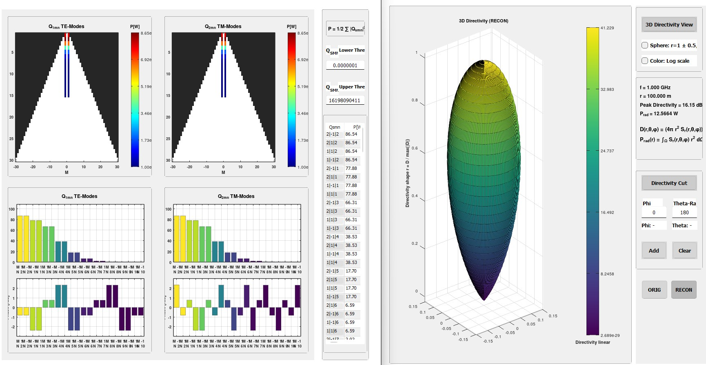

# Spherical Wave Expansion (SWE) – GNU Octave Implementation

📄 **Documentation / Formula Collection:**  
[SWE – A brief overview](SWE.pdf)

Implementation of the **Spherical Wave Expansion (SWE)** for electromagnetic field analysis and reconstruction based on the formulation introduced by **J. E. Hansen** in

*J. E. Hansen – Spherical Near-Field Antenna Measurements*

The formulation is widely used in electromagnetic field analysis and antenna characterization.  
It also forms the theoretical basis for spherical wave expansion techniques employed in commercial antenna analysis tools such as **TICRA GRASP**.

---

## Implementation

The software was developed and tested with

**GNU Octave 10.3.0**

Compatibility with **MATLAB has not been verified**.

Currently implemented features include

- outgoing spherical waves (C = 3)
- Clenshaw–Curtis quadrature
- Gauss–Legendre quadrature
- optional blocking or parallel computation for performance improvement

---

## Requirements

The implementation requires **GNU Octave 10.3.0** and the following packages:

- `gsl`
- `parallel` (optional, used for parallel computation)

---

## Quick Start

Run the implementation starting from the main script
